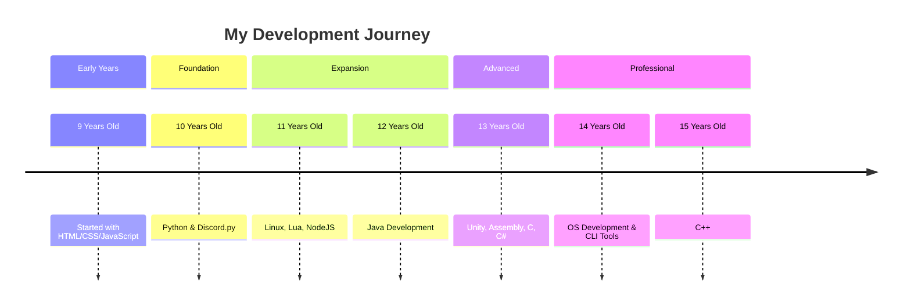

# 👋 Hi, I'm Anomaly Runtime

### Software Developer | OS Enthusiast | Server Administrator

---

## 🚀 About Me

I'm a passionate developer from Germany 🇩🇪 specializing in **OS development**, **server infrastructure**, and **full-stack programming**. Currently exploring the depths of low-level programming while building practical tools and applications.

- 🔭 **Currently working on:** URAN - An atmospheric horror game inspired by Bendy and the Ink Machine.
- 🌱 **Learning:** Advanced OS development, C/C++, and UEFI programming
- 💼 **Experience:** Python, PHP, HTML, Lua, and system administration
- 🎮 **Hobbies:** Game development, music production, and hardware optimization
- 🎯 **Goal:** Contributing to open-source and building developer tools

---

## 🛠️ Tech Stack

### Languages

### Technologies & Tools

### Infrastructure

---

## 🎯 Current Projects

### 🖥️ [SyncWide OS](https://github.com/SyncWide-Solutions/SyncWideOS)
A modern, efficient server operating system built from scratch with custom UEFI bootloader and kernel.
- **Tech:** C, Assembly, UEFI
- **Features:** Custom kernel, driver support, optimized for server environments

### ⚡ [24fire CLI Tool](https://github.com/AnomalyRuntime/24fire-api-cli)
Command-line interface for managing 24fire hosting services directly from the terminal.
- **Tech:** Python
- **Features:** API integration, server management, automation tools

### 🎮 URAN
An atmospheric horror game inspired by Bendy and the Ink Machine.
- **Tech:** Unity, C++
- **Status:** In active development

---

## 📊 GitHub Stats

---

## 🌟 Featured Repositories

---

## 🎓 Learning Journey

> **Note:** Continuously learning and expanding my skill set!

---

## 🤝 Let's Connect!

I'm always interested in collaborating on interesting projects, especially in:
- 🖥️ **Operating System Development**
- 🐍 **Python Applications**
- 🎮 **Game Development**
- 🔧 **Developer Tools & CLI Applications**

### 📫 Reach Me

- 📧 **Personal:** [i-am@anomalyruntime.com](mailto:i-am@anomalyruntime.com)
- 🌐 **Website:** [anomalyruntime.com](https://about.anomalyruntime.com)
- 💬 **Discord:** [dc.lukas-keller.org](https://dc.lukas-keller.org)

---

## 💖 Support My Work

If you find my projects helpful or interesting:

- ⭐ **Star** my repositories
- 🐛 **Report** bugs and issues
- 🔀 **Contribute** via pull requests
- ☕ [**Buy Me a Coffee**](https://buymeacoffee.com/LolgamerHD)

---

### 💡 "Code is like humor. When you have to explain it, it's bad." - Cory House
### 💡 "When you're coding you will always learn something, even if you have mastered a language." - Anomaly Runtime

---

⚡ Powered by passion for technology and endless curiosity

